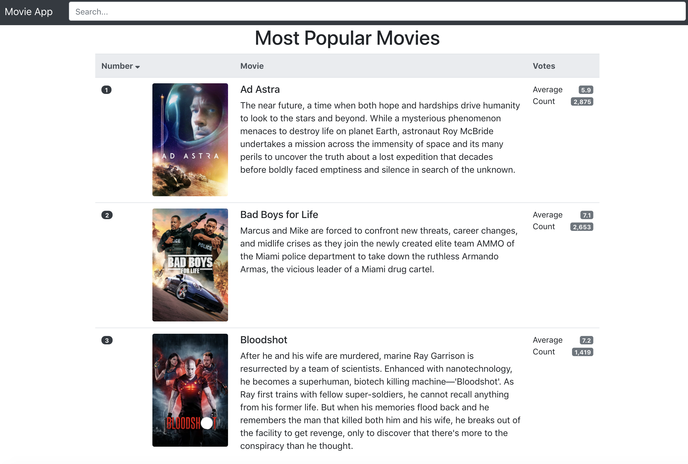
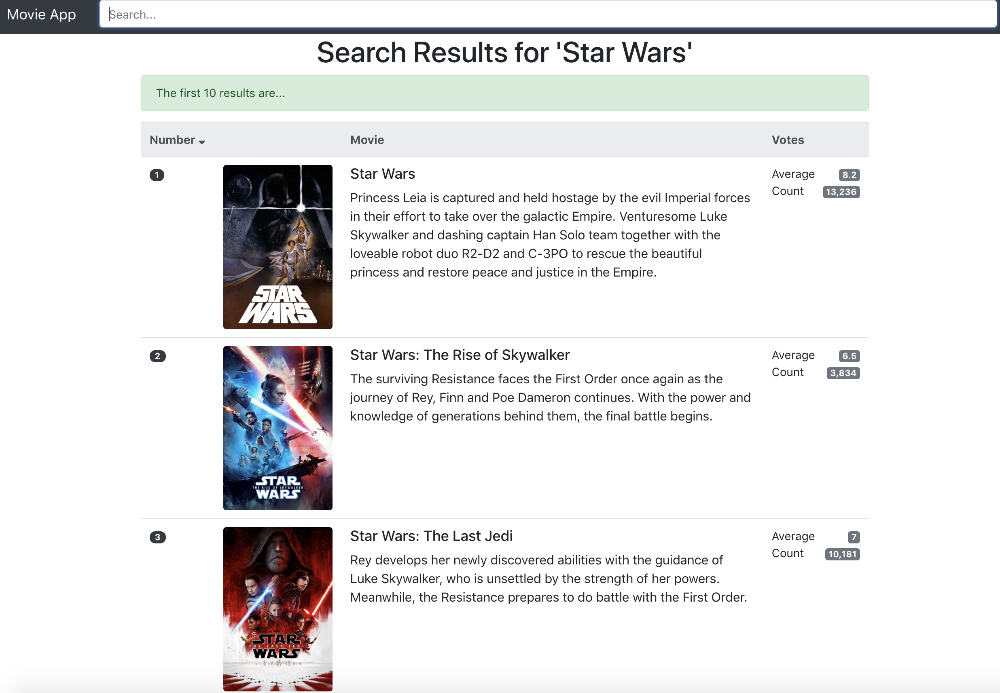
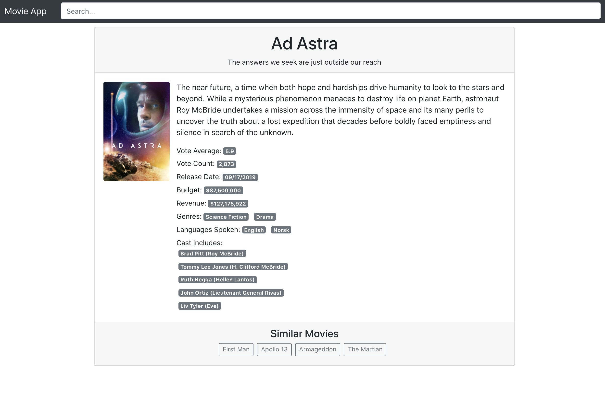

## Movie App

### Running the app locally:

* Ensure that Node and npm are installed: [https://docs.npmjs.com/downloading-and-installing-node-js-and-npm](https://docs.npmjs.com/downloading-and-installing-node-js-and-npm)
* Download the repo from GitHub (e.g., `git clone git@github.com:juliahazer/movie-app.git`)
* W/in the`api` subfolder, copy the `.env.default` and create a new `.env` file:
	* Add a valid The Movie Database API value to the `MOVIE_DB_API_KEY=` w/in the new `.env` file. (To create a new API key see: [https://www.themoviedb.org/settings/api](https://www.themoviedb.org/settings/api))
* W/in the `client` subfolder, copy the `.env.default` and create a new `.env` file. 
	* Populate the `.env` with `REACT_APP_API_BASE_URL=http://localhost:9000`
* Open two terminal windows, one with the `api` subfolder and the other with the `client` subfolder:
	* Run`npm install` within each terminal window to install dependencies.
	* From within each terminal window, run `npm start`
* Open `http://localhost:3000/` to see and interact w/ the Movie App, ensuring that `npm start` is running in both terminal windows (for `api` and `client`). 

### Features / Tech Requirements:

* Features and Tech Requirements are based on [https://gist.github.com/andrewhubbs/74084457bf74f136605d0346f932c85b](https://gist.github.com/andrewhubbs/74084457bf74f136605d0346f932c85b)

* Features include: 
	* The homepage is a list of the 10 most popular movies (i.e., rank, poster image, title, overview, vote average, vote count) (URL: [http://localhost:3000/](http://localhost:3000/))
		* **Added feature: Sorting Columns** – A user can click on each of the column headers to sort the results in ascending/descending order. 
	* A nav w/ a search bar is present globally. On search (by movie title), a list of up to 10 matching movie results are displayed (i.e., rank, poster image, title, overview, vote average, vote count). (Example URL: [http://localhost:3000/search/movie?query=star%20wars](http://localhost:3000/search/movie?query=star%20wars))
		* **Added feature: Sorting Columns** – A user can click on each of the column headers to sort the results in ascending/descending order. 
	* On click of a movie from either list (popular or search), the user is taken to a movie details page (e.g., with movie title, tagline, poster image, overview, vote average, vote count, release date, budget, revenue, genres, languages spoken, cast name/character (up to 5 listed), synopsis) (Example URL: [http://localhost:3000/movie/419704](http://localhost:3000/movie/419704))
		* **Added feature: Similar Movies** – This page includes a list of titles to up to 4 similar movies. On clicking the title, the user goes to that movie's detail page.

### Example Screenshots of the App:

1) Homepage with Popular Movies

2) Search Results Page

3) Movie Details Page

